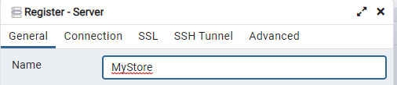
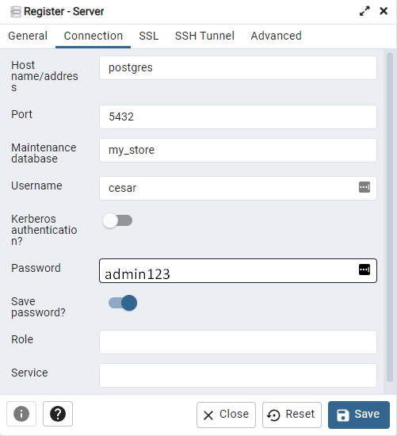
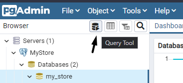
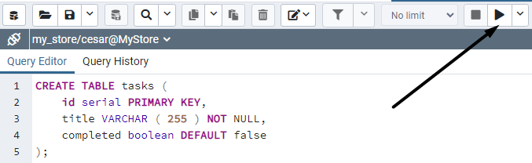
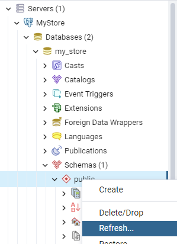
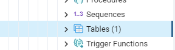
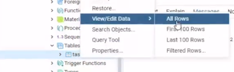
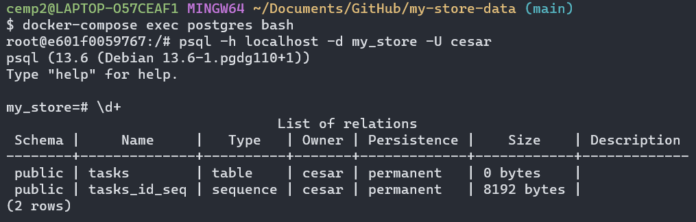
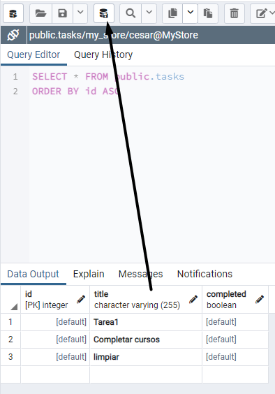

# Curso de Backend con Node.js: Base de Datos con PostgreSQL

Profesor: Nicolas Molina

## Configuración de postgres en Docker

Para crear la instacia de base de datos en postgres, se debe ejecutar el siguiente comando:

```
docker compose --env-file .env up -d
```

Inspeccionar el contenedor corriendo
  
  ```
  docker-compose ps
  ```

Detener y remover la instancia de base de datos
  
  ```
  docker-compose down
  ```

Se creó un volumen para persistir información de la base de datos
  

https://hub.docker.com/_/postgres

## Explorando Postgres: interfaces gráficas vs. terminal

Ingresar al contenedor de docker desde la terminal
  
  ```
  docker-compose exec postgres bash
  ```

Ingresando a la base de datos
  
  ```
  psql -h localhost -d my_store -U cesar
  ```
  
  Comando para conocer la estructura de la base de datos

  ```
  \d+
  ```

  Salir de la base de datos

  ```
  \q
  ```

Salir del contenedor

  ```
  exit
  ```

Motor gráfico para conectarse a la base de datos:
https://www.pgadmin.org/

Iniciar la instancia de pgadmin

```
docker-compose up -d pgadmin
```

Ingresando a pgadmin

```
http://localhost:5050
```

Conectando pgadmin4 con instancia de postgres


Object > Register  > Server




En host name se ingresó el nombre del servicio en docker-compose.yml: "postgres"

Para ejecutar querys se usa la herramienta query tool



Creando tabla

``` 
CREATE TABLE tasks (
	id serial PRIMARY KEY,
	title VARCHAR ( 255 ) NOT NULL,
	completed boolean DEFAULT false
);
```



Consultando la tabla desde pgadmin4




Consultano la tabla desde la terminal


## Integración de node-postgres

https://node-postgres.com/

Ingresando data desde pgadmin4



## Manejando un pool de conexiones

Un pool de conexiones es un conjunto limitado de conexiones a una base de datos, que es manejado por un servidor de aplicaciones de forma tal, que dichas conexiones pueden ser reutilizadas por los diferentes usuarios.

Hasta este punto por cada llamado a de un servicio a la base de datos se esta creando una conexión, de implementarse asi en todos los servicios se estarian creado multiples conexiones y esto no seria una buena practica.

Aquí entra la interfaz de Pool de conexiones que permite reutilizar la conexion en toda la aplicación.

Del modulo de pg admin importaremos el modulo de Pool y se reemplazará por la anterior configuración.

https://node-postgres.com/features/pooling

## Instalación y configuración de Sequelize ORM

https://sequelize.org/docs/v6/
https://sequelize.org/docs/v6/getting-started/
- 7-step instalación y configuración
- 8-step tu primer modelo en sequelize
- 9-step crear, actualizar y eliminar
- 10-step cambiando la base de datos a MySQL

Seteando el SGBD
al setear el sgbd a mysql, DB_USER será root e ignorará el valor pasado como variable de entorno.

## Migraciones

- 11-step - Migraciones en Sequelize ORM
- 12-step - Modificando una entidad (agregando una columna)
  https://sequelize.org/master/manual/migrations.html

## Relaciones

- 13-step - Relaciones uno a uno: Usuario tiene un Cliente, Cliente pertenece a Usuario
- 14-step - Resolviendo las relaciones uno a uno anidadas.
- 15-step/16-step - Relaciones uno a muchos: Categoría tiene Productos, Producto pertenece a Categoría
- 17-step - Resolviendo las relaciones uno a muchos anidadas
- 18-step - Relación uno a muchos: Cliente tiene Ordenes, Orden pertenece a Cliente
- 19-step - Relación Muchos a muchos: Orden tiene Productos, Productos pertenecen a una Orden
- 20-step - Resolviendo relaciones muchos a muchos anidadas
